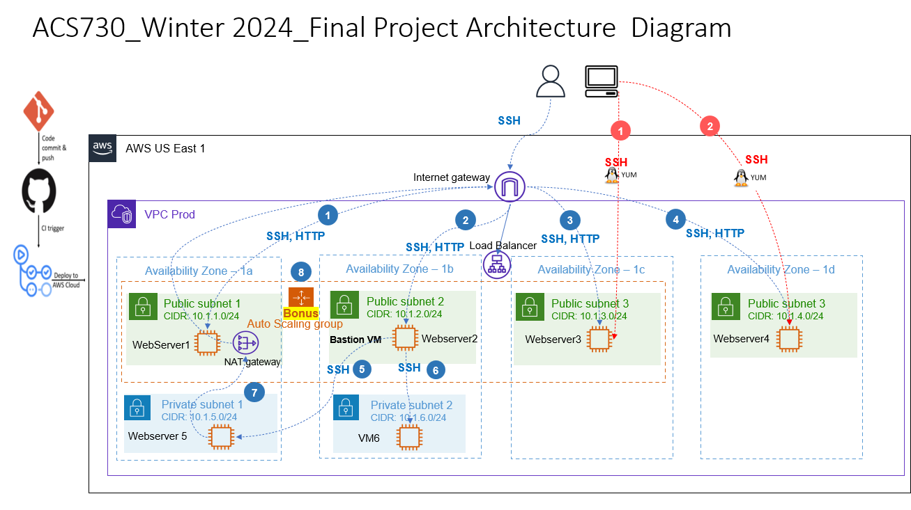

# AWS Terraform Ansible Project



This project provisions an AWS infrastructure using Terraform and configures it with Ansible. The architecture includes a Virtual Private Cloud (VPC) with multiple subnets spread across different availability zones. Each subnet hosts a Linux EC2 instance, with specific configurations detailed below. Ansible is employed to manage the installation of webservers and testing connectivity, utilizing dynamic inventory for automation.

## AWS Architecture Overview

- **VPC**: A Virtual Private Cloud is created with subnets distributed across four availability zones.
- **Public Subnets**: Four public subnets exist, each hosting a Linux EC2 instance with a webserver installed. These instances have SSH and HTTP access.
- **Private Subnets**: Two private subnets are established. EC2 instances reside in these subnets, inaccessible directly from the internet. A bastion host is deployed in the second public subnet to provide access to the private instances.
- **NAT Gateway**: A NAT Gateway is placed in the first public subnet, enabling internet access for the instances in the private subnets.

## Ansible Configuration

- **Webservers**: Ansible is utilized to install webservers on instances in Public Subnets 3 and 4.
- **Dynamic Inventory**: Ansible dynamically pulls inventory information for configuration management.
- **Connectivity Testing**: Ansible is employed to test connectivity between instances.

## Version Control and Environments

- **Git and GitHub**: Version control is managed using Git and hosted on GitHub.
- **Branches**: Separate branches are utilized for different environments, including production, staging, and development.

## Instructions to Run the Code

1. **Update AWS Credentials**:
   - Set AWS credentials as environment variables.
   
2. **Create S3 Bucket for Backend**:
   - Create an S3 bucket named "dev-group5-s3" to serve as the backend for Terraform.

3. **Navigate to Network Directory**:
   ```
   cd Network
   ```

4. **Provision using Terraform**:
   ```
   terraform init
   terraform plan
   terraform apply
   ```

5. **Navigate to Webserver Directory**:
   ```
   cd ../webserver
   ```

6. **Generate SSH Key**:
   ```
   ssh-keygen -t rsa -f projectkey
   ```

7. **Provision using Terraform**:
   ```
   terraform init
   terraform plan
   terraform apply
   ```

Follow these steps to provision the AWS infrastructure and configure it using Terraform and Ansible.